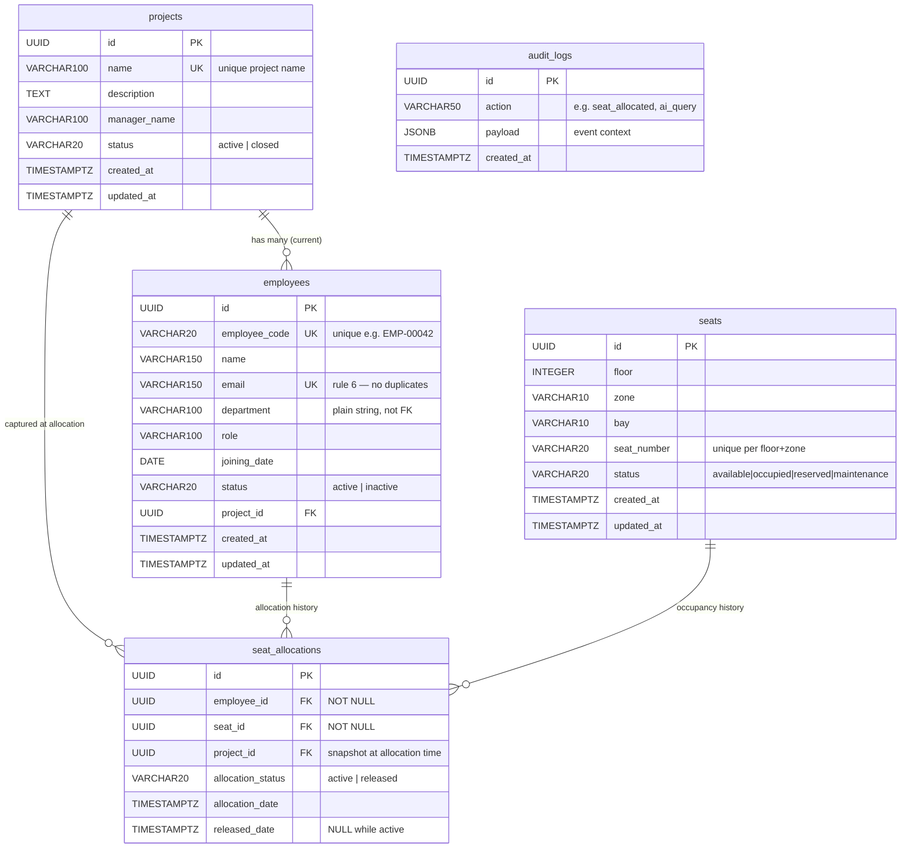

# Database Schema — Ethara Seat Allocation & Project Mapping System

> Generated from SQLAlchemy model definitions in `backend/app/models/`.
> PostgreSQL target. UUID primary keys throughout.

---

## Entity-Relationship Diagram

---

## Relationship Narrative

| Relationship | Cardinality | Notes |
|---|---|---|
| `Project` → `Employee` | 1 : many | `employees.project_id` FK — an employee's *current* project. Nullable for unassigned joiners. |
| `Project` → `SeatAllocation` | 1 : many | `seat_allocations.project_id` — project snapshot **at allocation time**. Preserved even if the employee later moves to another project. |
| `Employee` → `SeatAllocation` | 1 : many | Full allocation history. Active seat = the row where `allocation_status = 'active'`. |
| `Seat` → `SeatAllocation` | 1 : many | Full occupancy history. Only one row may be `active` at any time (partial index). |

---

## Model Descriptions

### `projects` table

| Column | Type | Nullable | Default | Notes |
|---|---|---|---|---|
| `id` | UUID | No | `uuid4()` | PK |
| `name` | VARCHAR(100) | No | — | UNIQUE — no two projects with the same name |
| `description` | TEXT | Yes | — | |
| `manager_name` | VARCHAR(100) | Yes | — | Plain string, no auth model |
| `status` | ENUM | No | `active` | `ProjectStatus`: `active` / `closed` |
| `created_at` | TIMESTAMPTZ | No | `now()` | Server default |
| `updated_at` | TIMESTAMPTZ | No | `now()` | Refreshed on every UPDATE |

**Indexes:** `name` (unique), `status`

---

### `employees` table

| Column | Type | Nullable | Default | Notes |
|---|---|---|---|---|
| `id` | UUID | No | `uuid4()` | PK |
| `employee_code` | VARCHAR(20) | No | — | UNIQUE — e.g. `EMP-00042` |
| `name` | VARCHAR(150) | No | — | |
| `email` | VARCHAR(150) | No | — | UNIQUE — rule #6 |
| `department` | VARCHAR(100) | Yes | — | Plain string, not a FK table |
| `role` | VARCHAR(100) | Yes | — | |
| `joining_date` | DATE | No | — | Used to identify new joiners |
| `status` | ENUM | No | `active` | `EmployeeStatus`: `active` / `inactive` |
| `project_id` | UUID | Yes | — | FK → `projects.id` `ON DELETE SET NULL` |
| `created_at` | TIMESTAMPTZ | No | `now()` | |
| `updated_at` | TIMESTAMPTZ | No | `now()` | |

**Constraints:** `UNIQUE(email)`, `UNIQUE(employee_code)`  
**Indexes:** `email`, `employee_code`, `project_id`, `department`, `status`, `joining_date`, `name`

---

### `seats` table

| Column | Type | Nullable | Default | Notes |
|---|---|---|---|---|
| `id` | UUID | No | `uuid4()` | PK |
| `floor` | INTEGER | No | — | 1–N |
| `zone` | VARCHAR(10) | No | — | e.g. `A`, `B`, `Z10` |
| `bay` | VARCHAR(10) | No | — | e.g. `Bay-1` |
| `seat_number` | VARCHAR(20) | No | — | e.g. `A1-05` |
| `status` | ENUM | No | `available` | `SeatStatus`: `available` / `occupied` / `reserved` / `maintenance` |
| `created_at` | TIMESTAMPTZ | No | `now()` | |
| `updated_at` | TIMESTAMPTZ | No | `now()` | |

**Constraints:** `UNIQUE(floor, zone, seat_number)` — rule #7  
**Indexes:** `(floor, zone)` compound, `floor`, `status`

---

### `seat_allocations` table

| Column | Type | Nullable | Default | Notes |
|---|---|---|---|---|
| `id` | UUID | No | `uuid4()` | PK |
| `employee_id` | UUID | No | — | FK → `employees.id` `ON DELETE RESTRICT` |
| `seat_id` | UUID | No | — | FK → `seats.id` `ON DELETE RESTRICT` |
| `project_id` | UUID | Yes | — | FK → `projects.id` `ON DELETE SET NULL` — **snapshot** |
| `allocation_status` | ENUM | No | `active` | `AllocationStatus`: `active` / `released` |
| `allocation_date` | TIMESTAMPTZ | No | `now()` | |
| `released_date` | TIMESTAMPTZ | Yes | — | `NULL` while active; set on release |

**Critical partial unique indexes:**

| Index name | Definition | Enforces |
|---|---|---|
| `uq_active_seat_per_employee` | `UNIQUE(employee_id) WHERE allocation_status = 'active'` | Rule #1 — one active seat per employee |
| `uq_active_alloc_per_seat` | `UNIQUE(seat_id) WHERE allocation_status = 'active'` | Rule #2 — one active employee per seat |

> **Why partial indexes?** A regular UNIQUE on `employee_id` would block the same employee from ever being re-allocated after release. The partial index constrains uniqueness **only among active rows**, so released rows accumulate as history without conflict.

**Additional indexes:** `employee_id`, `seat_id`, `allocation_status`, `allocation_date`, `(project_id, allocation_status)`

---

### `audit_logs` table

| Column | Type | Nullable | Default | Notes |
|---|---|---|---|---|
| `id` | UUID | No | `uuid4()` | PK |
| `action` | VARCHAR(50) | No | — | e.g. `seat_allocated`, `seat_released`, `ai_query` |
| `payload` | JSONB | Yes | — | Event-specific context |
| `created_at` | TIMESTAMPTZ | No | `now()` | Server default — immutable after insert |

> No `updated_at` — audit rows are never modified.

**Indexes:** `action`, `(action, created_at)` compound

---

## Enums

| Enum | PostgreSQL type name | Values |
|---|---|---|
| `ProjectStatus` | `projectstatus` | `active`, `closed` |
| `EmployeeStatus` | `employeestatus` | `active`, `inactive` |
| `SeatStatus` | `seatstatus` | `available`, `occupied`, `reserved`, `maintenance` |
| `AllocationStatus` | `allocationstatus` | `active`, `released` |

All enums inherit `str` so FastAPI serialises them as plain strings in JSON responses.

---

## Business Rules → DB Enforcement Map

| Rule | Spec # | Mechanism |
|---|---|---|
| One employee → one active seat | #1 | Partial unique index `uq_active_seat_per_employee` |
| One seat → one active employee | #2 | Partial unique index `uq_active_alloc_per_seat` |
| Released seats preserve history | #3 | `allocation_status = 'released'` + `released_date`; row never deleted |
| Reserved seats block allocation | #4 | Enforced at API layer (service logic — coming later) |
| Duplicate email not allowed | #6 | `UNIQUE(email)` constraint |
| Duplicate seat per floor/zone not allowed | #7 | `UNIQUE(floor, zone, seat_number)` constraint |

---

## Files

| File | Description |
|---|---|
| `backend/app/models/enums.py` | All four enums (`ProjectStatus`, `EmployeeStatus`, `SeatStatus`, `AllocationStatus`) |
| `backend/app/models/base.py` | `UUIDPrimaryKeyMixin` + `TimestampMixin` |
| `backend/app/models/project.py` | `Project` model |
| `backend/app/models/employee.py` | `Employee` model |
| `backend/app/models/seat.py` | `Seat` model |
| `backend/app/models/seat_allocation.py` | `SeatAllocation` model (partial unique indexes) |
| `backend/app/models/audit_log.py` | `AuditLog` model |
| `backend/app/models/__init__.py` | Re-exports all models; ensures Alembic autogenerate registration |
